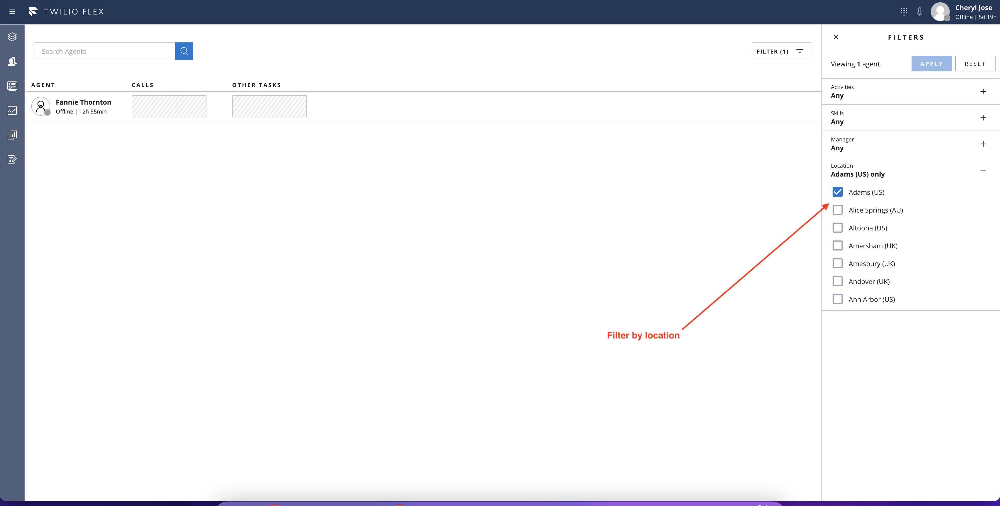
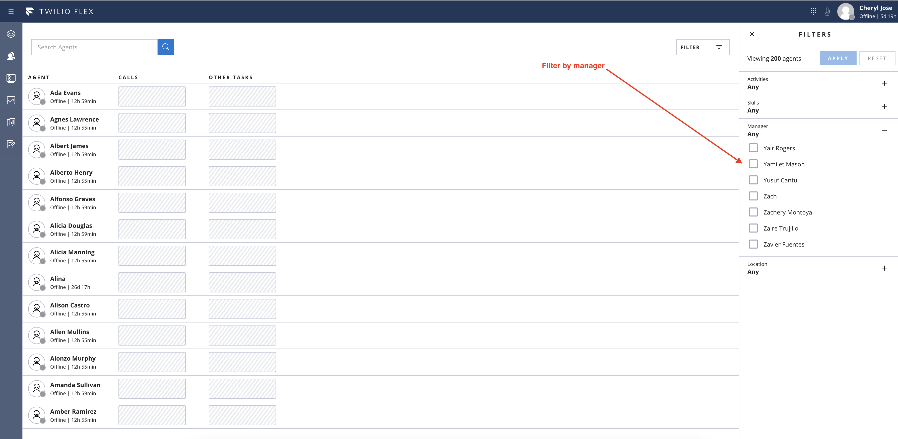
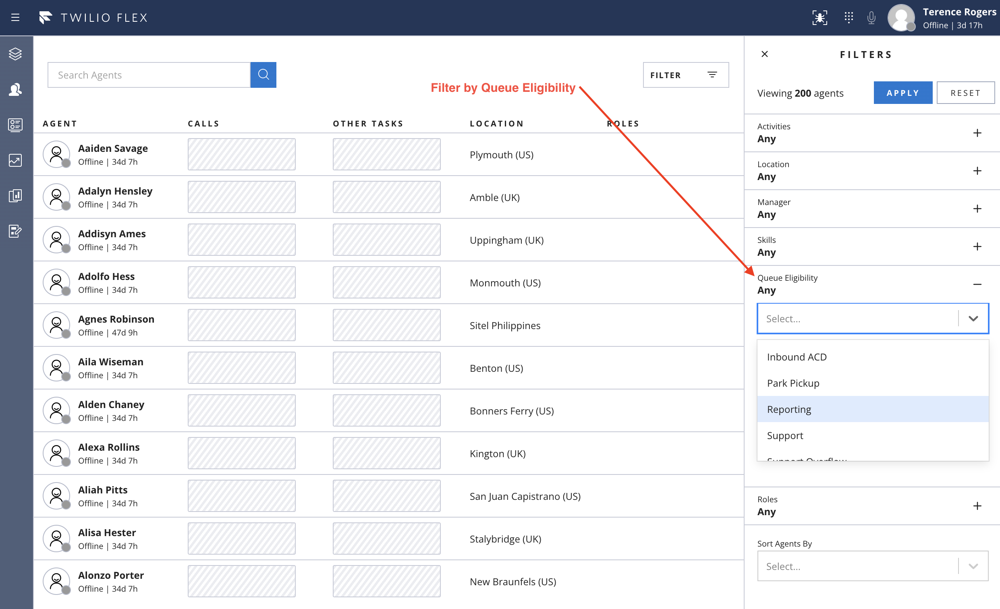
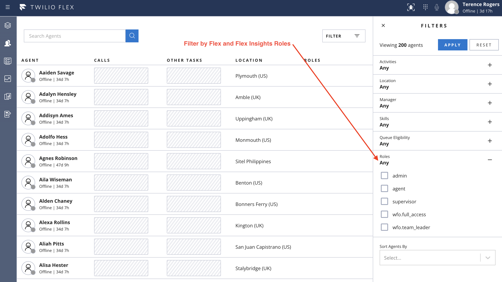
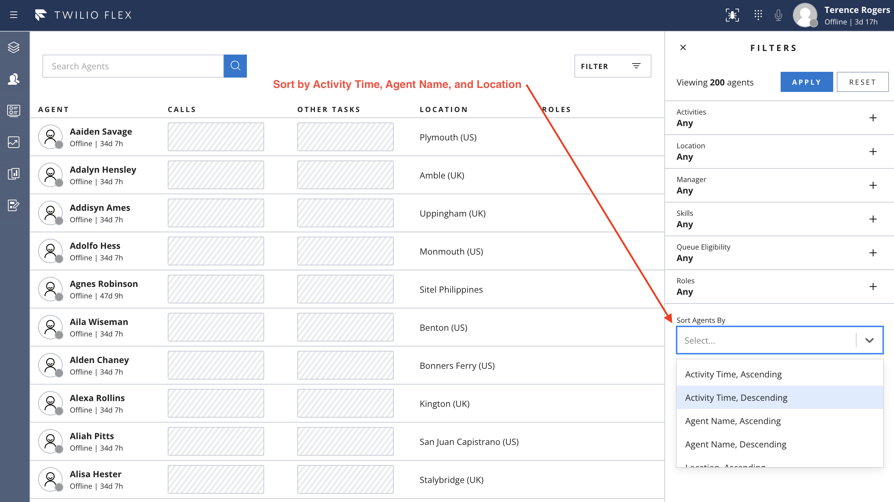
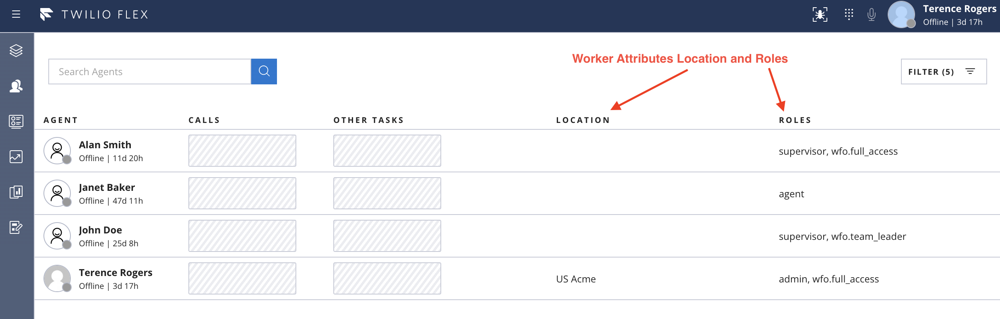

<a href="https://www.twilio.com">

</a>

# Twilio Flex Plugins

Twilio Flex Plugins allow you to customize the appearance and behavior of [Twilio Flex](https://www.twilio.com/flex). If you want to learn more about the capabilities and how to use the API, check out our [Flex documentation](https://www.twilio.com/docs/flex).


## Plugin for customizing Teams View Filter

This plugin allows you to add and customize filters for filtering on managers, skills, locations, roles, and queue eligibility on Teams View dashboard. It also adds the Location and Roles worker attributes to the worker data table and adds the ability to sort on Activity Time, Agent Name, and Location. 

Please refer to the screenshots below for examples: 

 






## Flex Plugin
### Requirements

To deploy this plugin, you will need:

- An active Twilio account with Flex provisioned. Refer to the [Flex Quickstart](https://www.twilio.com/docs/flex/quickstart/flex-basics#sign-up-for-or-sign-in-to-twilio-and-create-a-new-flex-project") to create one.
- npm version 5.0.0 or later installed (type `npm -v` in your terminal to check)
- Node.js [long term support(LTS) version](https://nodejs.org/en/about/releases/)(type `node -v` in your terminal to check)

### Setup

Make sure you have [Node.js](https://nodejs.org) as well as [`npm`](https://npmjs.com) installed.

1. Clone this repo:

2. Go to the plugin directory

```bash
cd plugin-teamview-filter
```

3. Install the dependencies

```bash
npm install
```

4. Rename or copy `.env.sample` to `.env`

```bash
cp .env.sample .env
```

5. Edit the `.env` file and populate `REACT_APP_SERVERLESS_DOMAIN` variable with the domain of the serverless functions deployed in the Serverless section of this README

6. Run plugin on a local environment using Twilio CLI :

```bash
twilio flex:plugins:start
```

6. Ensure you are using the right Twilio CLI profile (`twilio profiles: list`) and deploy the plugin to your Flex project:

```bash
twilio flex:plugins:deploy --major --changelog "Notes for this version" --description "Functionality of the plugin"
```

More detailed information about deploying Flex plugins can be found here: https://www.twilio.com/docs/flex/developer/plugins/cli/deploy-and-release

## Serverless
### Requirements

You will need the [Twilio CLI](https://www.twilio.com/docs/twilio-cli/quickstart) and the [serverless plugin](https://www.twilio.com/docs/labs/serverless-toolkit/getting-started) to deploy the functions inside the ```serverless``` folder of this project. Please follow the instructions at those links before proceeding if you do not already have the Twilio CLI and Serverless Plugin installed.

### Setup

1. Clone this repository if you haven't already

2. Go to the serverless directory

```bash
cd serverless-teamview-filter
```

3. Install the dependencies

```bash
npm install
```

4. Rename or copy `.env.sample` to `.env`

```bash
cp .env.sample .env
```

5. Edit the `.env` file and populate `TWILIO_FLEX_WORKSPACE_SID` with the TaskRouter Workspace SID for the target Flex account. `ACCOUNT_SID` and `AUTH_TOKEN` are only needed if you will be running the serverless functions locally for testing. The other environment variables control retry and backoff timers; feel free to adjust as desired.

6. Ensure you are using the right Twilio CLI profile (`twilio profiles:list`) and deploy the serverless function to your Flex project:

```bash
twilio serverless:deploy
```

7. Note the serverless domain returned by the CLI command and use that domain in your plugin's `REACT_APP_SERVERLESS_DOMAIN` environment variable

More detailed information about deploying Twilio serverless functions can be found here: 
https://www.twilio.com/docs/labs/serverless-toolkit/deploying
